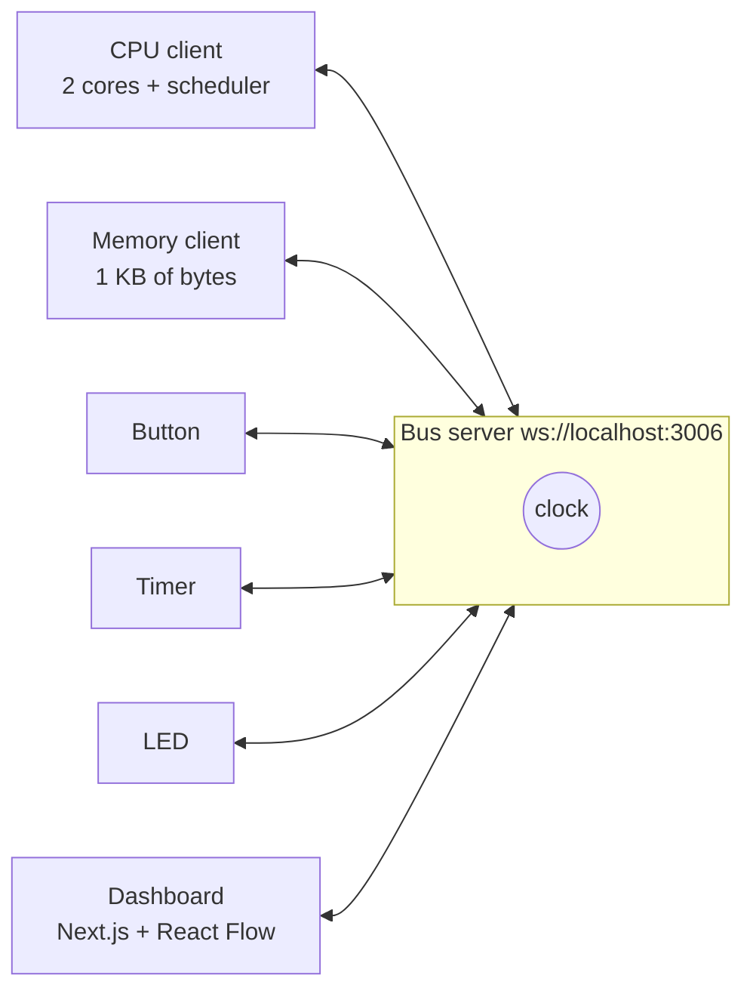
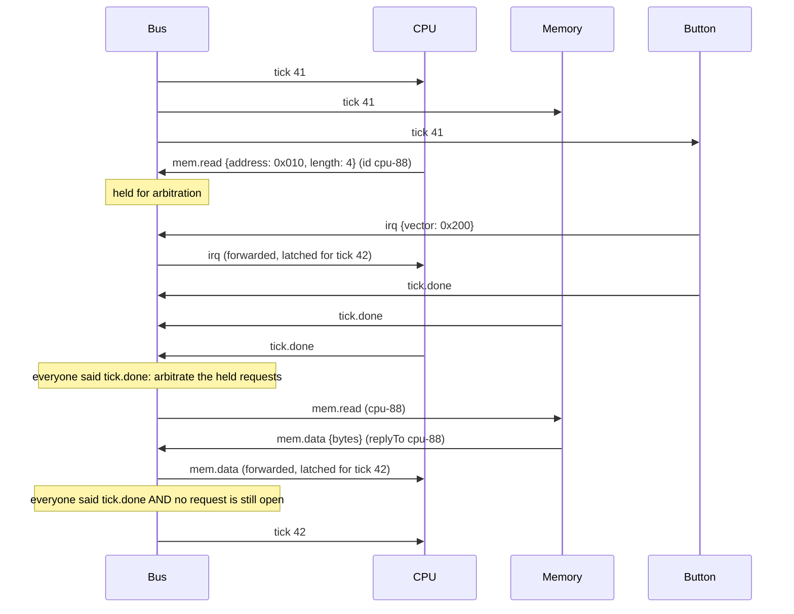
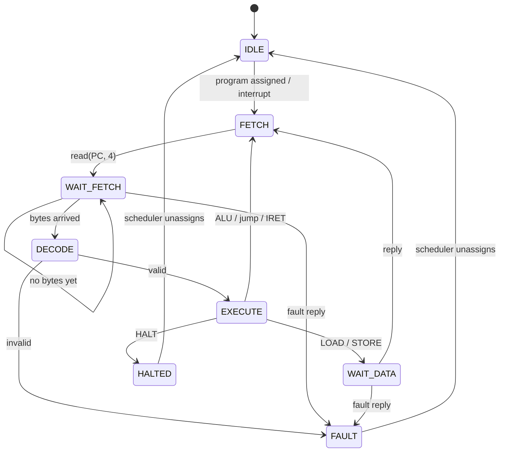
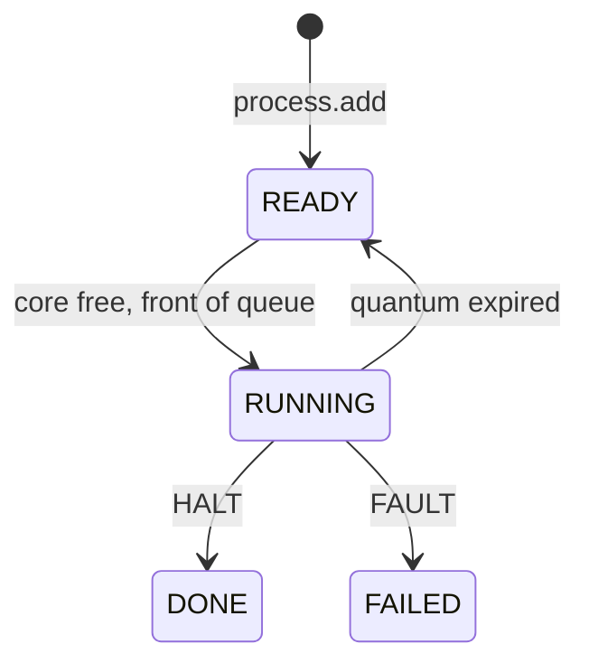
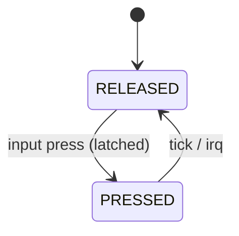

# NetSim Architecture

This is the map of the simulated computer you build in this course. Read it once at the start,
then come back to the section for each week.

## The big picture

A real computer is several chips that talk over shared wires (a **bus**) in step with a
**clock**. NetSim copies that shape with small programs that talk over WebSockets:



- The **bus server** owns the clock and routes messages. It knows nothing about CPUs or memory.
- Every other box is a **component**: a separate program that connects to the bus, says hello,
  and then reacts to messages. Each component is a **finite state machine** (FSM).
- The **dashboard** is also just a client. It watches all the traffic and draws it live.

The one pattern to learn: **every component is a pure function plus a thin shell.**

```ts
// The pure part: no network, no timers, easy to test.
function step(state: State, event: Event): { state: State; effects: Effect[] }

// The shell: turns bus messages into events, and effects into bus messages.
```

The pure part is where all the thinking lives and where almost all your tests point. The shell
is the same few lines for every component. (This is often called *functional core, imperative
shell*.)

## File layout

```
core/                     Pure logic. No WebSockets, no timers. Unit tested.
  isa.ts                  Opcodes, decode / encode / disassemble
  asm.ts                  Tiny assembler: "LOADI R0, 5" -> bytes (labels, .equ, .byte, symbols)
  cpu-core.ts             One CPU core as an FSM (fetch / decode / execute)
  scheduler.ts            Round-robin scheduler
  interrupts.ts           Pending-interrupt queue (priority order)
  cpu.ts                  The whole CPU: 2 cores + scheduler + interrupts, one tickCpu()
  memory.ts               The 1 KB byte array, bounds checks, snapshot
  fsm.ts                  Transition-table helper + mermaid export
  todo.ts                 The placeholder your unfinished regions call

protocol/
  messages.ts             Every message on the wire: zod schemas + TypeScript types
  memory-map.ts           Which address range is for what

bus/
  server.ts               startBus(): routing, clock, tick barrier, watchdog, dashboard tap
  saves.ts                Save/restore the whole system to saves/*.json
  start.ts                `npm run bus`

components/
  client.ts               connect(): the shell every component uses (hello, send, request, ticks)
  cpu.ts                  CPU shell: runs core/cpu.ts on the bus
  memory.ts               Memory shell: answers mem.read / mem.write / program.load
  host.ts                 Starts peripherals when the dashboard asks, loads their handlers
  logger.ts               Prints every message on the bus (LOG=1)
  run.ts                  `npm run component -- memory cpu host`
  peripherals/
    peripheral.ts         The peripheral contract + the one shell that runs any peripheral
    button.ts             Reference peripheral
    timer.ts  sensor.ts  proximity.ts  potentiometer.ts
    led.ts  seven-segment.ts  screen.ts
    index.ts              kind -> definition (the host and the dashboard read this)

programs/                 Demo programs and interrupt handlers (*.asm), index.ts catalogue,
                          read.ts (Node only: source + bytes)
app/                      Next.js dashboard (React Flow)
tests/week-01 ... week-08 Vitest tests, grouped by the week that unlocks them; helpers.ts
setup.mjs                 Guided laptop setup (zero dependencies, runs before the repo exists)
scripts/                  doctor, hello, demo, asm, fsm-export, make-week-branches, catch-up
docs/notes/               Your weekly notes (week 1: setup and a Codex exercise)
course/                   Instructor only: the students' AGENTS.md source (never in week branches)
```

Rules of thumb:

- `core/` never imports from `components/`, `bus/` or `app/`. If you are tempted to, you are
  mixing logic with plumbing.
- Types live next to the code that owns them. Wire types live in `protocol/messages.ts` because
  both ends of a socket need them.
- No file suffixes like `.service.ts` or `.component.tsx`. The folder already says what it is.

## The message protocol

### Envelope

Every message is one JSON object:

```ts
type Envelope = {
  type: string;        // what kind of message; picks the payload shape
  from: string;        // component id of the sender, e.g. "cpu", "memory", "btn-1"
  to: string;          // component id, "bus", or "*" (everyone)
  id: string;          // unique per message, e.g. "cpu-17"
  replyTo?: string;    // set on a reply: the id of the request it answers
  tick: number;        // the clock tick the sender was on when it sent this
  payload: ...;        // depends on type
};
```

`protocol/messages.ts` defines each message type as a zod schema, and the TypeScript type is
derived from it with `z.infer`. All messages together form a **discriminated union** on `type`,
so this compiles and narrows correctly:

```ts
switch (msg.type) {
  case "mem.read":  msg.payload.address; // TS knows the payload shape here
  case "irq":       msg.payload.vector;
}
```

**Validate at the boundary.** Bytes that come off a socket are `unknown`. The shell calls
`parseMessage(raw)` exactly once; it returns either a typed message or an error that is logged
and reported back to the sender as `error`. Nothing past that line ever sees unvalidated data.

Why zod rather than a hand-written validator: the schema and the type are one thing, so they
can never drift apart, and adding a message type is one schema line instead of a type, a guard
function and a test for the guard. A hand-written validator for ~20 message types would be
several hundred lines of `typeof` checks that teach little after the first one. (Week 2 still
has you write one tiny validator by hand first, so you know what zod is doing for you.)

### Message types

| type | from → to | payload | meaning |
|---|---|---|---|
| `hello` | component → bus | `{ role, kind?, label }` | "I'm here." `role` is `cpu`, `memory`, `peripheral` or `dashboard` |
| `welcome` | bus → component | `{ tick, running, components }` | Handshake reply: current clock and who else is connected |
| `joined` / `left` | bus → `*` | `{ id, role, kind? }` | Someone connected / disconnected |
| `tick` | bus → `*` | `{}` | One clock edge. The number is in the envelope's `tick` |
| `tick.done` | component → bus | `{}` | "I've finished reacting to this tick" |
| `mem.read` | any → memory | `{ address, length }` | Request bytes |
| `mem.data` | memory → requester | `{ address, bytes }` | Reply to `mem.read` |
| `mem.write` | any → memory | `{ address, bytes }` | Request a write |
| `mem.ack` | memory → requester | `{ address, length }` | Reply to `mem.write` |
| `fault` | any → requester | `{ code, message }` | Reply instead of data when a request is illegal (e.g. address out of range) |
| `irq` | peripheral → cpu | `{ vector, priority }` | Raise an interrupt. `vector` = handler address |
| `input` | dashboard → peripheral | depends on peripheral kind | A person pressed/dragged something |
| `status` | component → `*` | `{ state, label, data, position? }` | What the dashboard should draw for this component |
| `control` | dashboard → bus | `{ action: "start" \| "stop" \| "step" \| "reset" \| "speed", ms? }` | Clock controls |
| `program.load` | dashboard → memory | `{ address, bytes }` | Put a program in memory (acks with `mem.ack`) |
| `process.add` | dashboard → cpu | `{ name, start }` | Tell the scheduler about a new program |
| `host.spawn` / `host.remove` | dashboard → host | `{ kind, id, config }` / `{ id }` | Start / stop a peripheral |
| `save` / `restore` | dashboard → bus | `{ name }` | Persist or reload the whole system |
| `snapshot.get` / `snapshot` / `snapshot.set` | bus ↔ component | `{ data }` | How the bus collects and restores each component's state |
| `error` | any → sender | `{ message }` | Your message was invalid or unknown |

### A clock tick, step by step

The bus drives time. One tick goes like this:



The **tick barrier** is what makes the simulation deterministic: the bus starts tick N+1 only
when

1. every *clocked* component (CPU, Memory, peripherals) has sent `tick.done` for tick N, **and**
2. every request sent during tick N (`mem.read`, `mem.write`) has had its reply.

The bus can check (2) because it forwards every message: it keeps a small ledger of open
request ids and crosses one off when a message with a matching `replyTo` goes past.

### Bus arbitration

Two components can want the bus in the same tick. For example, a sensor writes its register
while a CPU core reads that same address. If Memory handled them in whatever order the network
delivered them, the core would sometimes read the old value and sometimes the new one, and the
same program could give different results. Real hardware solves this with a **bus arbiter**,
which grants the bus in a fixed priority order. NetSim does the same (`arbitrate()` in
`bus/server.ts`):

1. During a tick, the bus **holds** every `mem.read` and `mem.write` instead of forwarding it.
2. When every clocked component has sent `tick.done`, all of that tick's requests are in. The bus
   sorts them by **sender id** and hands them to Memory in that order. Each sender's own requests
   keep the order it sent them in.
3. Memory answers as usual, the ledger empties, and the tick ends.

So in one tick, `cpu` always goes before `sensor-1`. A write in tick N is seen by every read
from tick N+1 on, and in tick N by reads from senders that sort after the writer. Replies still
arrive inside the same tick, so nothing gets slower. Requests sent while the clock is stopped
(loading a program, the host installing a handler) go straight through.

Messages that arrive between ticks are **latched**: a component stores them and only acts on
them in its next `tick` handler. That is exactly how a flip-flop works: inputs can wiggle, but
the state only changes on the clock edge. The result is that the same program with the same
button presses produces the same trace every time, which is what makes the tests possible.

If a component never answers (it crashed or has a bug), the bus waits `tickTimeoutMs` (default
2 s), then marks it `stalled`, sends a `status` about it to the dashboard, and carries on
without it. That is the bus's watchdog.

### How the CPU gets bytes from Memory

The CPU never touches memory directly. On the tick when a core is in `FETCH`, the pure core
function returns an effect:

```ts
{ kind: "read", address: pc, length: 4, tag: "fetch" }
```

The CPU shell sends that as `mem.read` and records `id -> (core 0, "fetch")`. When `mem.data`
arrives it becomes the event `{ type: "memData", bytes }` for core 0, delivered on the next tick.
So every memory access costs the core one tick of waiting, which is a nice, visible stand-in for
real memory latency.

### How peripherals raise interrupts

A peripheral's pure function returns `{ kind: "irq" }` as an effect; its shell sends
`irq { vector, priority }` to `cpu`. The CPU shell puts it in the interrupt queue
(`core/interrupts.ts`). At the start of each tick, any core that is **between instructions**
(state `FETCH` or `IDLE`) and not already handling an interrupt may take the most urgent pending
interrupt: it saves its registers, PC and flags, and jumps to `vector`. `IRET` restores them.
Lower `priority` number = more urgent. Idle cores are preferred so running programs are
disturbed as little as possible.

### How the dashboard observes

A client that says `hello { role: "dashboard" }` gets a copy of **every** message the bus
routes (the tap), plus `welcome`, `joined` and `left`. It never needs to poll. Each component
also sends a `status` message whenever its FSM state changes:

```ts
{
  type: "status",
  from: "btn-1",
  to: "*",
  payload: {
    state: "PRESSED",                 // current FSM state
    label: "Power button",            // node title
    data: { presses: 3 },             // small values the node shows
    position: { x: 80, y: -160 }      // optional preferred spot on the canvas
  }
}
```

The dashboard keeps `Map<componentId, latest status>` and turns it into React Flow nodes. It
draws an edge for each `from -> to` pair it has seen and flashes it when a message goes past.
The dashboard sends `control`, `input`, `program.load`, `process.add`, `host.spawn`, `save` and
`restore`, and nothing else.

## Memory map

1 KB, byte addressed, addresses `0x000`–`0x3FF`. All of it is ordinary memory; the map is a
convention that programs and peripherals agree on (`protocol/memory-map.ts`).

| Range | Use |
|---|---|
| `0x000`–`0x1FF` | Programs (the dashboard loads demos at `0x000`, `0x080`, `0x100`) |
| `0x200`–`0x2FF` | Interrupt handlers, one 32-byte slot per peripheral: slot *n* at `0x200 + 0x20·n` |
| `0x300`–`0x3DF` | Free data |
| `0x3E0`–`0x3EF` | Interrupt counters: slot *n*'s handler increments `0x3E0 + n` |
| `0x3F0`–`0x3FF` | **Device registers** (memory-mapped I/O), one byte per peripheral |

**Memory-mapped I/O** is how the CPU talks to devices without special instructions: an input
device (potentiometer, proximity sensor) writes its reading into its register byte, and an output
device (LED, seven-segment, screen) reads its register byte each tick and shows it. A program that
does `STORE R0, 0x3F2` turns an LED on if the LED watches `0x3F2`.

## Instruction set

Every instruction is exactly 4 bytes: `[opcode, a, b, c]`. Registers are `R0`–`R3`, 8 bits each.
Flags: `zero` (last ALU result was 0) and `carry` (last ADD overflowed / last SUB borrowed).

| Hex | Mnemonic | Bytes | Effect | Flags |
|---|---|---|---|---|
| `00` | `NOP` | `00 00 00 00` | nothing | – |
| `01` | `LOAD Rd, addr` | `01 d hi lo` | `Rd = mem[addr]` | zero |
| `02` | `STORE Rs, addr` | `02 s hi lo` | `mem[addr] = Rs` | – |
| `03` | `ADD Rd, Rs` | `03 d s 00` | `Rd = Rd + Rs` (wraps at 256) | zero, carry |
| `04` | `SUB Rd, Rs` | `04 d s 00` | `Rd = Rd - Rs` (wraps at 0) | zero, carry |
| `05` | `JMP addr` | `05 00 hi lo` | `PC = addr` | – |
| `06` | `LOADI Rd, imm` **new** | `06 d 00 imm` | `Rd = imm` (0–255) | zero |
| `07` | `JZ addr` **new** | `07 00 hi lo` | if `zero`: `PC = addr` | – |
| `08` | `JNZ addr` **new** | `08 00 hi lo` | if not `zero`: `PC = addr` | – |
| `FE` | `IRET` | `FE 00 00 00` | return from interrupt handler | restored |
| `FF` | `HALT` | `FF 00 00 00` | stop this program | – |

`addr` is 16 bits big-endian (`hi << 8 | lo`) but must be below `0x400`. An unknown opcode, a
register number above 3, or an address out of range sends the core to `FAULT` instead of being
silently ignored, so bugs show up on the dashboard instead of hiding.

With `LOADI` and `JNZ`, programs can finally loop:

```asm
; count down from 5 and show each value on the seven-segment display
        LOADI R0, 5
        LOADI R1, 1
loop:   STORE R0, 0x3F1     ; seven-segment register
        SUB   R0, R1
        JNZ   loop
        HALT
```

## State machines

Each FSM is declared as a **transition table** in code (`core/fsm.ts` gives you `defineFsm`).
The table is used three ways: the runtime refuses any transition not in it, the tests check it,
and `npm run fsm:export` turns it into mermaid diagrams in `docs/diagrams/`. The diagrams below
are simplified copies for reading; when in doubt, the tables in code are the truth.

### CPU core

One tick = one transition. An `ADD` takes 4 ticks (FETCH, WAIT_FETCH, DECODE, EXECUTE); a
`LOAD` or `STORE` takes 5 because it waits for memory a second time.

| From | Event (on tick) | Guard | To | Effect |
|---|---|---|---|---|
| `IDLE` | tick | scheduler gave this core a program | `FETCH` | – |
| `IDLE`, `FETCH` | tick | interrupt pending, not in handler | `FETCH` | push frame, `PC = vector` |
| `FETCH` | tick | – | `WAIT_FETCH` | `read(PC, 4)` |
| `WAIT_FETCH` | tick | bytes arrived | `DECODE` | `IR = bytes` |
| `WAIT_FETCH` | tick | no bytes yet | `WAIT_FETCH` | count a stall |
| `DECODE` | tick | valid instruction | `EXECUTE` | – |
| `DECODE` | tick | invalid | `FAULT` | – |
| `EXECUTE` | tick | ALU / jump / NOP / IRET | `FETCH` | update regs, flags, PC |
| `EXECUTE` | tick | `LOAD` | `WAIT_DATA` | `read(addr, 1)` |
| `EXECUTE` | tick | `STORE` | `WAIT_DATA` | `write(addr, Rs)` |
| `EXECUTE` | tick | `HALT` | `HALTED` | – |
| `WAIT_DATA` | tick | reply arrived | `FETCH` | `LOAD`: set `Rd`; `PC += 4` |
| any waiting state | `fault` reply | – | `FAULT` | – |
| `HALTED`, `FAULT` | scheduler unassigns | – | `IDLE` | – |



Interrupts are only taken **between instructions** (`IDLE` or `FETCH`), never halfway through
one. Real CPUs do the same, for the same reason: a half-executed instruction is very hard to
resume.

### Scheduler (round robin, two cores)

The scheduler runs at the start of every CPU tick, before the cores step. Per process:

| From | Event | To |
|---|---|---|
| `READY` | a core is `IDLE` and this is first in the queue | `RUNNING` (context restored onto that core) |
| `RUNNING` | quantum used up (4 instructions) and someone is waiting, core between instructions, not in a handler | `READY` (context saved, back of the queue) |
| `RUNNING` | core `HALTED` | `DONE` |
| `RUNNING` | core `FAULT` | `FAILED` |



The quantum counts completed **instructions**, not ticks, so a program is never switched out
while it is waiting on memory. The old priority-based and non-preemptive schedulers are gone.

### Memory

Memory answers requests in the same tick it gets them, so its FSM is tiny. It exists mostly so
the dashboard can show what memory is doing.

| From | Event | To | Effect |
|---|---|---|---|
| `READY` | `mem.read` / `mem.write` in range | `READY` | reply `mem.data` / `mem.ack` |
| `READY` | request out of range | `READY` | reply `fault` |

The `status` it reports each tick is `READING`, `WRITING` or `READY`, depending on what it did
that tick, plus the addresses touched. A `program.load` is reported straight away, since it
doesn't happen during a tick.

Known simplification: `lastRead` and `lastWrite` hold only the **most recent** read and write of
the tick. When both cores fetch in the same tick, only one of the two reads is highlighted; the
dashboard's message log still shows both `mem.read`s.

### Bus

| From | Event | To |
|---|---|---|
| `STOPPED` | `control start` | `RUNNING` |
| `STOPPED` | `control step` | `TICKING` (then back to `STOPPED`) |
| `RUNNING` | timer fires | `TICKING` |
| `TICKING` | barrier met (all `tick.done`, no open requests) | `RUNNING` or `STOPPED` |
| `TICKING` | `tickTimeoutMs` passed | `RUNNING`/`STOPPED`, late components marked stalled |
| `RUNNING` | `control stop` | `STOPPED` |

`save` and `restore` are only accepted while `STOPPED`.

### Peripherals

Every peripheral has the same shape (`components/peripherals/peripheral.ts`):

```ts
type PeripheralDefinition<State extends Json, Input, Config> = {
  kind: string;                        // "button"
  label: string;                       // default name
  direction: "input" | "output";       // input: raises IRQs / writes a register. output: reads one
  defaultPriority: number;
  configSchema: z.ZodType<Config>;     // fields for the "Add peripheral" form
  inputSchema: z.ZodType<Input>;       // what the dashboard may send it
  stateSchema: z.ZodType<State>;       // checks a saved snapshot before restoring it
  fsm: Fsm<string>;                    // its transition table (core/fsm.ts)
  init(config: Config): State;
  onInput(state: State, input: Input): State;                     // latched, applied next tick
  onTick(state: State, ctx: TickContext): { state: State; effects: PeripheralEffect[] };
  view(state: State): { state: string; data: Record<string, Json> };
  snapshot?(state: State): Json;       // optional: what to save (default: the whole state)
  restore?(data: unknown): State;      // optional: rebuild from a save (default: stateSchema.parse)
};

type PeripheralEffect =
  | { kind: "irq" }                                  // send irq to the CPU
  | { kind: "write"; value: number }                 // write my register byte
  | { kind: "read" };                                // read my register byte (reply arrives next tick)
```

`TickContext` is `{ tick, register }`: the tick number and the last byte read from its register
(`null` before the first read). `startPeripheral(definition, { id, wiring, config })` is the one
shell for all of them: it handles hello, latching inputs, turning effects into messages, `status`,
`reset` and snapshots. `components/peripherals/index.ts` lists them as `entry(definition)` so the
host and the dashboard can hold every kind in one array; the dashboard builds the "Add peripheral"
form from `z.toJSONSchema(entry.configSchema)`.

**Wiring** comes from the memory map, not from the peripheral: the host gives each new peripheral
a free slot *n*, which fixes its `vector` (`0x200 + 0x20·n`), `counter` (`0x3E0 + n`) and
`register` (`0x3F0 + n`). For input peripherals the host also loads the default handler
(`programs/isr-counter.asm`: increment the counter, `IRET`) at the vector.

| Peripheral | Dir | States | IRQ when |
|---|---|---|---|
| Button | in | `RELEASED`, `PRESSED` | the tick after a press |
| Timer | in | `STOPPED`, `COUNTING` | every `interval` ticks |
| Sensor (temperature) | in | `BELOW`, `ABOVE` | value crosses the threshold upwards; writes value to its register |
| Proximity sensor | in | `FAR`, `NEAR` | distance drops inside the radius; writes distance |
| Potentiometer | in | `STABLE`, `SETTLING` | value stopped changing for 3 ticks; writes value |
| LED | out | `OFF`, `ON` | never; `ON` when its register is ≥ 128 |
| Seven-segment | out | `SHOWING` | never; shows its register as decimal digits |
| Screen | out | `DRAWING` | never; scrolls one column per `divider` ticks |

Button, the reference:



## Persistence

Every stateful pure module has `snapshot(state)` and `restore(data)`. On `save { name }` the
bus (which must be `STOPPED`) sends `snapshot.get` to every component, waits for each
`snapshot` reply, and writes:

```json
{ "version": 2, "tick": 812, "savedAt": "2026-10-04T15:00:00Z",
  "components": { "cpu": { ... }, "memory": { ... }, "btn-1": { "kind": "button", ... } } }
```

to `saves/<name>.json`. `restore` reads the file, validates it with zod, asks the host to spawn
any peripheral that is missing, and sends each component its `snapshot.set`.

## Running it

```
npm run dev:all                      # bus + memory + cpu + host + dashboard (http://localhost:3005)
npm run bus                          # just the bus (BUS_HOST, BUS_PORT, BUS_SPEED)
npm run component -- memory cpu host # components (BUS_URL; LOG=1 also prints all traffic)
npm run demo                         # load the demo programs and peripherals, start the clock
npm run demo -- --ticks 300          # ...or run 300 ticks headless and print a summary
node setup.mjs                       # week 1: set up the laptop step by step (before the repo exists)
npm run setup                        # ...the same, again, from inside the course folder (--dry-run to only show)
npm run doctor                       # week 1: is this machine and clone ready?
npm run hello                        # week 2: say hello to the bus
npm run asm -- programs/countdown.asm            # assemble and print a listing
npx vitest                           # tests (watch mode); npx vitest run tests/week-03
npm run fsm:export                   # write docs/diagrams/*.md from the transition tables
npm run course:catch-up -- 3         # copy the published week-3 solution into your regions
npm run weeks -- --verify            # instructor: check the generated week branches
```

## Instructor setup: a shared live bus

In week 1 students watch Praise's live system; from week 2 every student connects to one bus on
Praise's machine.

1. On the instructor machine: `BUS_HOST=0.0.0.0 npm run bus`. The bus now accepts connections
   from the local network (the default, `127.0.0.1`, only accepts this machine). Find the LAN
   address with `ipconfig getifaddr en0` (macOS) or `hostname -I` (Linux). The OS firewall may
   ask to allow incoming connections on port 3006.
2. Students run their client with `BUS_URL=ws://<Praise's IP>:3006 npm run hello`.
3. If students aren't on the same network (remote class, locked-down campus Wi-Fi), put a tunnel
   in front of the bus instead, e.g. `cloudflared tunnel --url http://localhost:3006` or
   `ngrok http 3006`, and hand out the `wss://…` address it prints as `BUS_URL`.
4. Run the dashboard on the projector: `npm run dev` on the instructor machine. It connects to the
   local bus, and every student who joins appears as a node.

Things to know about a shared bus:

- Component ids must be unique; ask students to use their GitHub username as their id.
- Only clients that say `role: "dashboard"` may start, stop or reset the clock. That keeps
  honest mistakes from stopping the class, but it is not security: anyone can claim to be a
  dashboard. Don't expose the bus beyond the class, and stop the tunnel after the session.
- A student client that never answers `tick` is marked `stalled` after `tickTimeoutMs` (once week
  6's watchdog is in; before that the tick just waits the full timeout each time), so one broken
  client slows the clock but doesn't stop it.
